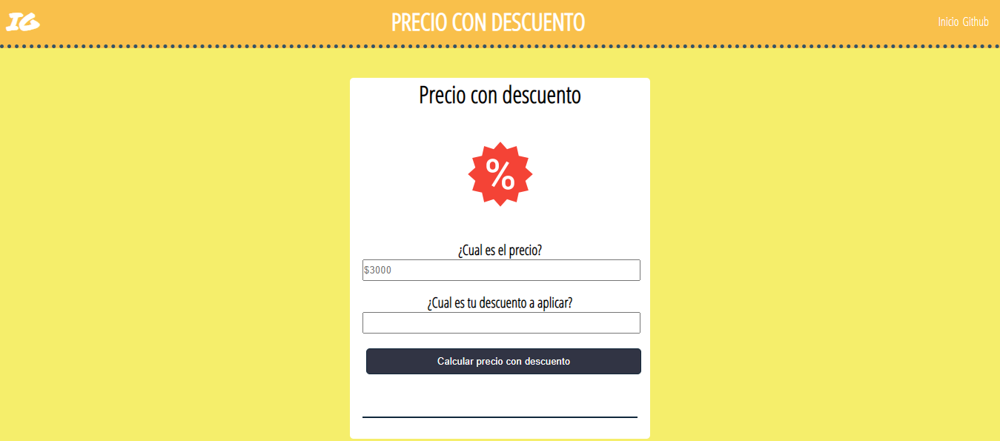

### PAGINA DE MATEMATICAS - PRACTICA JAVASCRIPT

Es una recoleccion de paginas realizadas para estudiar y poner en practica, conocimientos de javascript.

* En ella se encontrara una pagina para calcular perimetro y area de las figuras geometricas.

* Una pagina para los descuentos.

* Descuentos con cupon, en esta se selecciona el producto en adquirir, y puede colocar el cupon para que se le haga el descuento respectivo.

* Por ultimo una pagina para el calculo de horas extras segun el salario del individuo.

Hecho con mucho cariño :fa-heart:
